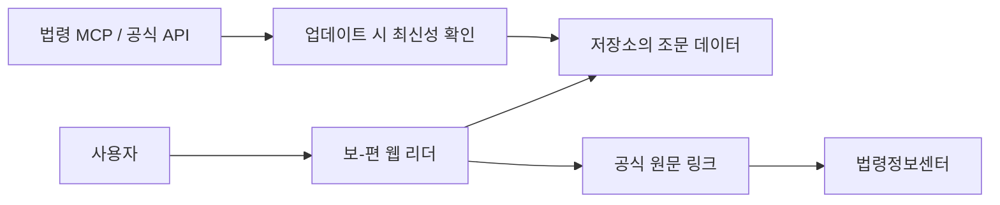

# 📖 보-편 | 보호법 편히보기

개인정보보호법을 빠르게 찾고 편하게 읽는 개인용 법령 리더기입니다.

하루에도 몇 번씩 보호법을 찾아보는 개인정보 담당자분들을 위해 바이브코딩을 활용해 공개 PoC로 개발했습니다.

법령정보센터에서 법률·시행령·고시를 오가며 찾느라 번거로웠다면, 이제 보호법 전용 웹사이트에서 한 번에 확인해보세요.

## ✨ 주요 기능

- 법률·시행령·고시 통합 조회
- 조문 검색 및 목차 탐색
- 연결 규정(시행령·고시) 바로 확인
- 법령정보센터 원문을 기준으로 정리한 조문 데이터
- 업데이트 시 법령 MCP 또는 공식 API로 최신성 확인
- PC·모바일 최적화
- 다크모드·글자 크기 조절·인쇄 지원

사용해보시고 개선 의견도 편하게 부탁드립니다! 😊

## 이 레포를 공개한 이유

이 프로젝트의 목적은 완성된 상용 법률 서비스가 되는 것이 아니라, 실제 업무에서 자주 찾는 공공정보를 바이브코딩으로 작고 유용한 도구로 만드는 과정을 공유하는 것입니다.

이 레포에서는 다음을 직접 확인하고 응용할 수 있습니다.

- 공식 원문을 기준으로 읽기 화면을 구성하는 방법
- 법률·시행령·고시처럼 연결된 문서를 한 화면에서 보여주는 방법
- 서버와 데이터베이스 없이 정적 웹앱으로 먼저 검증하는 방법
- 법령 MCP/API를 이용해 업데이트 시 최신성을 확인하는 흐름
- 공식 PDF를 복제하지 않고 원문 링크로 안내하는 방법
- 같은 구조를 사내 규정, 조례, 매뉴얼, 약관 리더기로 바꾸는 방법

즉, 이 저장소는 “개인정보보호법 리더기”이면서 동시에 “공공 문서 리더기를 시작하는 작은 참고 구현”입니다.

## 서비스가 작동하는 흐름



사용자가 웹사이트를 열면 저장소에 포함된 화면과 조문 데이터가 브라우저에서 바로 표시됩니다. 조문을 읽는 동안 MCP 서버에 실시간으로 연결하는 구조는 아닙니다.

법령 MCP/API는 업데이트 담당자가 개정 여부를 확인할 때 사용하는 선택적 도구입니다. 확인한 뒤 조문 데이터와 출처를 고치고, 테스트와 빌드를 통과시켜 다시 공개합니다.

## 다른 서비스로 응용하는 방법

1. `src/law-data.js`에서 화면이 읽는 문서 데이터를 찾습니다.
2. 개인정보보호법 조문을 조례·고시·사내 규정·매뉴얼 등 원하는 문서로 바꿉니다.
3. 제목, 본문, 관련 문서 링크, 출처 확인일을 함께 기록합니다.
4. 화면의 서비스명과 안내 문구를 새 문서에 맞게 바꿉니다.
5. `npm.cmd test`와 `npm.cmd run build`로 확인합니다.

자세한 설명은 아래 문서에서 이어집니다.

- [처음 시작하기](docs/getting-started.md)
- [구조 이해하기](docs/architecture.md)
- [내 서비스에 맞게 바꾸기](docs/adapting-your-service.md)

## 로컬에서 실행하기

```powershell
npm.cmd ci
npm.cmd test
npm.cmd run build
npx serve dist
```

마지막 명령은 빌드된 `dist` 폴더를 로컬 정적 서버로 여는 예시입니다. 다른 정적 서버 도구를 사용해도 됩니다.

## 공개 레포에 포함하지 않은 것

공개와 재사용에 필요한 핵심만 남기기 위해 아래 항목은 포함하지 않습니다.

- 공식 PDF 원본 파일 묶음
- 개인 Vercel 프로젝트 ID와 운영 배포 설정
- 운영용 환경 변수, 토큰, 비밀값
- 비공개 분석·관리자 API·데이터베이스 연결
- 사용자를 추적하는 분석 코드
- 내부 작업용 초안과 개인 대화 기록

공식 문서는 링크로 안내합니다. 따라서 이 레포를 복제해도 공식 자료의 이용 조건과 최신 여부를 별도로 확인해야 합니다.

## 법률정보 한계

이 저장소는 법률정보를 편하게 읽기 위한 공개 PoC입니다. 법률 자문이나 법적 판단을 대신하지 않습니다. 실제 업무, 신고, 계약, 분쟁에 적용하기 전에는 반드시 법령정보센터 등 공식 출처에서 현재 유효한 원문과 최신 개정 여부를 확인하세요.
