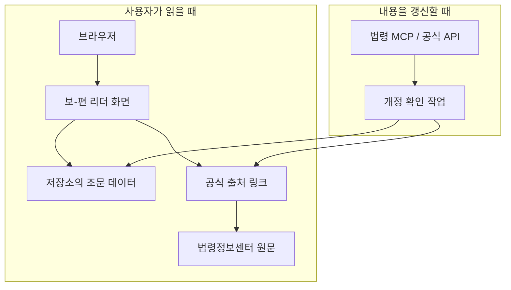

# 구조 이해하기

이 저장소는 “먼저 작동하는 읽기 화면을 만들고, 필요할 때만 기능을 늘리는” 웹앱입니다. 브라우저가 HTML, CSS, JavaScript, 이미지, 조문 데이터를 내려받아 화면을 만들며, 사용자가 조문을 검색하거나 열 때 별도 서버를 거치지 않습니다. 헤더의 선택적 방문자 배지만 공개 집계 API를 읽습니다.

## 한눈에 보는 구성

## 각 부분의 역할

| 부분 | 하는 일 | 이 레포에서 볼 곳 |
| --- | --- | --- |
| 화면 | 검색, 목차, 조문 표시, 글자 크기와 다크모드 제공 | `index.html`, `src/` |
| 조문 데이터 | 화면에 표시할 법률·시행령·고시 내용 보관 | `src/law-data.js` |
| 출처 목록 | 공식 원문과 첨부자료를 확인할 링크 보관 | `assets/legal-sources/` |
| MCP/API | 업데이트 시 공식 원문과 개정 여부 확인 | 갱신 작업 문서 |
| 빌드 | 필요한 정적 파일을 `dist/`에 모음 | `scripts/build.mjs` |

## 사용자가 읽을 때

1. 사용자가 보-편 리더를 엽니다.
2. 브라우저가 저장소의 화면 파일과 조문 데이터를 읽습니다.
3. 사용자는 검색, 목차 이동, 관련 규정 확인을 이용합니다.
4. 원문 확인이 필요하면 법령정보센터 공식 링크로 이동합니다.

방문자 배지가 켜져 있으면 브라우저가 공개 집계 API를 한 번 읽고 `Total · Today` 숫자만 표시합니다. Vercel Analytics 토큰과 Supabase 서비스 키는 서버 환경변수에만 둡니다.

## 내용을 갱신할 때

1. 업데이트 담당자가 법령 MCP 또는 공식 API로 개정 여부를 확인합니다.
2. 공식 페이지에서 바뀐 조문과 출처를 다시 확인합니다.
3. 저장소의 조문 데이터와 공식 출처 목록을 수정합니다.
4. 테스트와 빌드를 통과시킨 뒤 공개 저장소에 반영합니다.

MCP는 선택적인 갱신 시점 도구입니다. 일반 사용자의 브라우저가 MCP 서버나 공식 API에 직접 연결하지 않으므로, 방문자 배지가 없어도 법령 리더를 실행할 수 있습니다. 이 단순한 경계를 공개해 둔 덕분에 처음 시작하는 사람도 화면, 데이터, 갱신 작업을 각각 나누어 이해할 수 있습니다.

## 공개 레포에서 일부러 단순하게 둔 경계

- 화면과 조문 데이터는 공개해 누구나 읽고 바꿀 수 있습니다.
- 운영 토큰과 관리자 기능은 공개 리더와 분리하고, 방문자 배지는 숫자만 반환하는 제한된 공개 API로 연결합니다.
- 공식 PDF는 저장소에 복제하지 않고 공식 URL로 안내합니다.
- 법령 원문을 저장한 데이터는 최신 개정 여부를 다시 확인해야 합니다.

이 구조는 기능이 부족해서가 아니라, 다른 사람이 자신의 문서 리더로 복제하고 확장하기 쉽도록 공개 PoC의 범위를 작게 잡은 것입니다.

