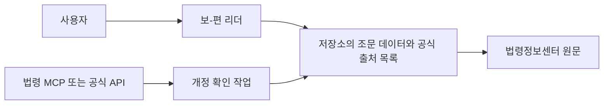

# 구조 이해하기

이 저장소는 정적 웹앱입니다. 브라우저가 HTML, CSS, JavaScript, 이미지, 조문 데이터를 내려받아 화면을 만듭니다. 사용자가 조문을 검색하거나 열어도 별도 서버에 요청하지 않습니다.

## 읽을 때의 흐름

1. 사용자가 보-편 리더를 엽니다.
2. 리더는 저장소에 포함된 조문 데이터와 공식 출처 목록을 읽습니다.
3. 사용자는 화면의 공식 출처 링크를 통해 법령정보센터 원문을 확인할 수 있습니다.

## 갱신할 때의 흐름

1. 관리자는 법령 MCP 또는 공식 API로 개정 여부를 확인합니다.
2. 확인 결과를 바탕으로 저장소의 조문 데이터와 공식 출처 목록을 수정합니다.
3. 테스트와 빌드를 통과한 뒤 공개 저장소에 반영합니다.

법령 MCP는 선택적인 갱신 시점 도구입니다. 브라우저에서 리더를 사용할 때 필요한 의존성이 아니며, 사용자의 브라우저가 MCP 서버나 공식 API에 직접 연결하지 않습니다.
